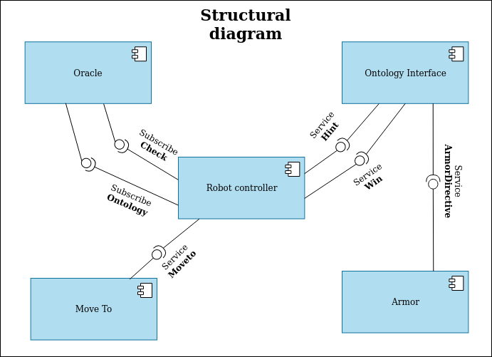
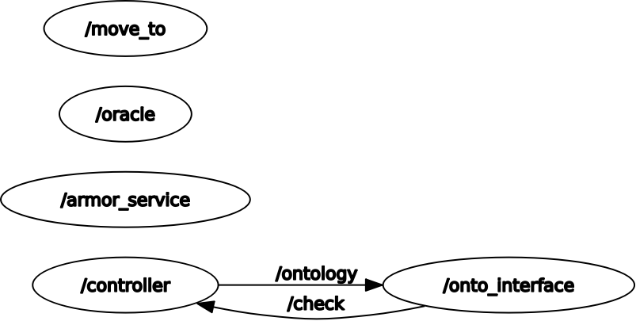
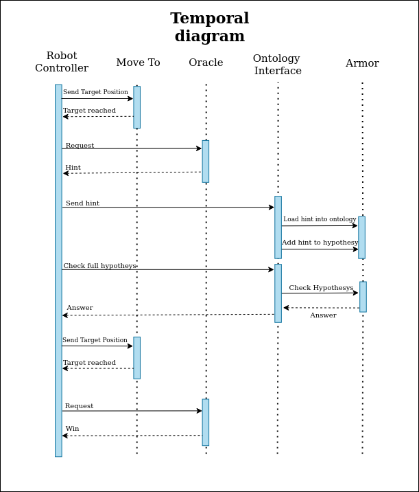
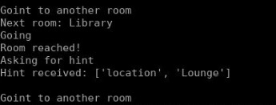
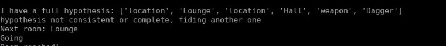
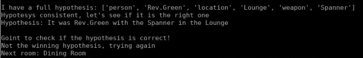
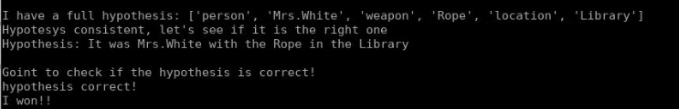

# Experimental Robotics Laboratory - First assignment

###### Maria Luisa Aiachini 4375373

## Description
This assignment is a Cluedo simulator. There is a robot going around reaching random rooms. Once the robot reaches one it asks for a hint to a Oracle. It gives back a hint that belongs to a given hypothesis. The robot changes room and goes on taking hints until it has a full hypothesis. One this happens the robots checks if the hypothesis is complete and consistent and, if it is, goes to home for checking if it is the winning one: if it is the game stops, if not it starts wandering again to find more hints.

## Architecture
For this project there are four nodes: Robot controller, Oracle, Move to and Ontology Interface. Also there is the Armor server, which was not implemented for this assignment, but was given. In the following figure there is the component diagram to better understand how the nodes communicate with each other.
### Component diagram
In this figure there are all the nodes and all their connections.


- [Robot Controller](https://github.com/Marilwoo/exprob_assignment1/blob/master/scripts/controller.py)
The robot controller node is the main one. It controls all the possible behaviours of the robots and talks to all the other nodes (Except for Armor Service). It is a client for the service of type `hint` that is used for communicating with the oracle asking for a hint. It is also client of the service `winning` again for communicating with the oracle to check if the hypothesis is the winning one. Finally it is client of the service `moveto` to simulate the robot movement.
This node also contains the publisher to the topic `/ontology` that is used for sending to the ontology interface node the single hint the robot receives in roder to load it into the ontology. Finally it is subscriber to the topic `/check` fo checking if the hyopothesis is complete and consistent.
In the main function it also contains a simple FSM that depending on the global variable `state` executes the different functions.

- [Oracle](https://github.com/Marilwoo/exprob_assignment1/blob/master/scripts/oracle.py) The Oracle node is the one managing the hints. In this node there are defined four hypothesis, each with an ID, and in each of these there are three hints. Once the robot reaches a room it sends a request to the service `hint`; then this node chooses a random ID between the possible hypothesis and then choses one of the hints. It then sends both the ID and the hint to the controller node. For being sure that the same hint is not sent more than once, after sending the hint it is deleted from the corresponding list. This node also is used to check if the hypothesis is the winning one. As soon as the robot have a full hypothesis and after having checked that the hypothesis is both complete and consistent it goes to a specific location and sends to this node the ID of this hypothesis through the `/win` client. At this point the oracle compares the received ID with the winning one and returns to the controller a boolean for the result.

- [Move to](https://github.com/Marilwoo/exprob_assignment1/blob/master/scripts/move_to.py) This node is used to simulate the robot movement. When the robot needs to go to a new room the controller choses randomly one of the 8 possible rooms. Once is chosen it sends the target position to this node via the service `move_to_srv`. For now this node is just a wait, it will be implemented in the future. Once the robot reaches the room it sends as a response a boolean to the controller node.

- [Ontology interface](https://github.com/Marilwoo/exprob_assignment1/blob/master/scripts/onto_interface.py) This node is the one that interfaces with the ontology. For doing that it uses the service `armor_interface_srv` and the messages `ArmorDirectiveReq` and `ArmorDirectivRes` that were already implemented in the armor package. This server is used for loading the hints in the ontology, in fact it is subscriber oin the topic `/ontology` from which receives the ID and the hint and also it receives an integer for knowing what to do: loading a person, loading a location, loading a weapon or checking a full hypothesis. For this last case it is a publisher on the topic `/check` which sends back to the controller a boolean to check the completeness and the consistency of an hypothesis.

### Graph of the system
Here is the graph of the system to better understand the above explanation.


### Temporal diagram


Above you can see the temporal diagram. Here is described the complete functioning of the program. It starts from the robot controler sending the Move_To node the room in which the robot has to go. When the robot reaches the room a True boolean is returned. Once the room is reached the Controller sends to the oracle a request for a hint and the oracle sends back and ID and the hint itself. At this point the controller sends it to the Ontology interface and it loads it in the ontology through Armor. Once the robot has a full hypothesys (three hints with the same ID) it sends it again to the Ontology interface that, again through armor, checks if the hypothesys is complete and consistent and returns it to the Controller. If this result is positive the robot goes to the home position, calling again the Move to node, and, once reached, it sends the hypothesis ID to the Oracle node to check if the hypothesis is the winning one. 


### Ros messages
There are three different ros msgs. The first one is the check_msgs which contains simply a boolean:
```
bool check
```
Then there is the Hint message, containing the ID and the hint itself:
```
string ID
string hint
```
Finally there is the onto msgs containing the ID and the message as well as an integer that tells the ontology node what to do:
```
int32 to_do
string ID
string class_1
```
### Ros services
There are three services. The first one is hint_serv that has no request and in return has the ID and the hint
```
---
string ID
string hint
```
The second one is move_to_srv it has positions x and y of the room target and has a boolean as a response.
```
int32 posx
int32 posy
---
bool reached
```
Finally there is the win service. It contains the ID of the hypothesis that needs to be checked and as a response a boolean for the result.
```
string ID
---
bool result
```

## Screenshots of relevant parts
In the execution of the program there are four relevants parts:
Here is the movement simulation


Here is the case of an hypothesis not complete or consistent


Here is the case of complete and consistent hypothesis, but it is not the winning one


Here is the case of hte winning hypothesis



## Instructions
1. For this project the needed package can be downloaded or cloned from:
https://github.com/Marilwoo/exprob_assignment1.git

2. After building the package, the simulation can be launched by executing the command:
```
roslaunch exprob robot.launch
```

## System features
I tried to keep this system simple. In fact I decided to have a main node, the Robot Controller, that is the one interfacing with all the other nodes. I used mainly publish-subscribe and request-reply architectures and I used them depending on the informations the nodes needed to pass each other.

## System limitation
Probably the system can be implemented to become more efficient by exploiting more the messages and the services I created, it is possible that some of them can be used for passing information in a more efficient way to more than one node at a time.

## Possible improvement
Surely the main improvement to this system will be the implementation of a real movement node. By now all the movement is simulated with a sleep inside the node `move_to`.

Also will be an improvement the use of a simulated enviroment to better understand the movement and the features of this system.
## Contacts
- Maria Luisa Aiachini: s4375373@studenti.unige.it
